# Global Superstore Sales Analysis

## Table of Contents

- [Overview](#overview)
- [Data Cleaning](#data-cleaning)
- [Company Overview](#company-overview)
- [Customer Analysis](#customer-analysis)
- [Research Questions](#research-questions)
- [Returns Analysis](#returns-analysis)
- [Discount Analysis](#discount-analysis)
- [Customer Retention](#customer-retention)
- [Conclusion](#conclusion)
- [Appendix](#appendix)

## Overview

This project comprehensively analyzes Global Superstore sales data using Power BI. The dashboard visualizes key business metrics and insights to support data-driven decision making for a global retail business.

## Data Cleaning
* Solution 1
* Solution 2

### EDA Process

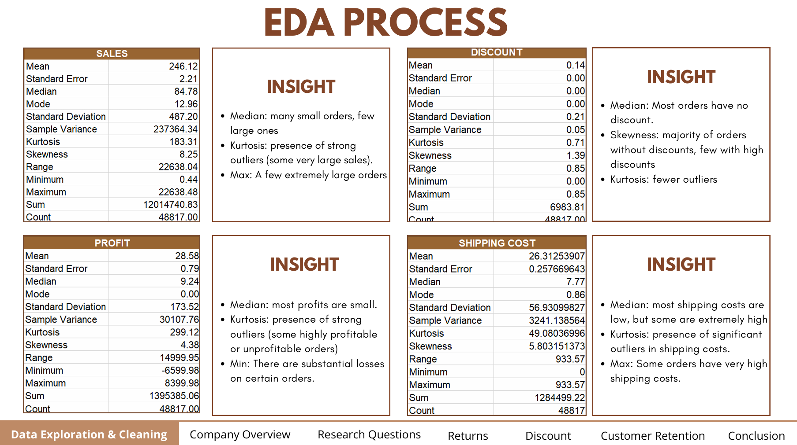

## Company Overview

### Global Superstore's Performance

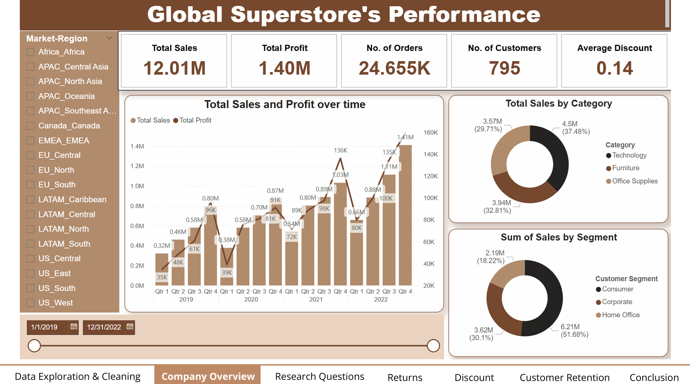

## Customer Analysis

### Who are our customers?

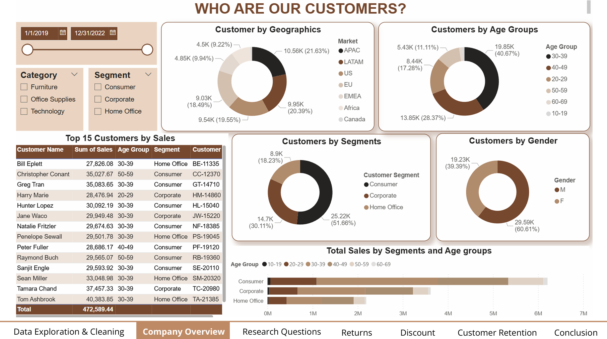

### Where do our customers come from?

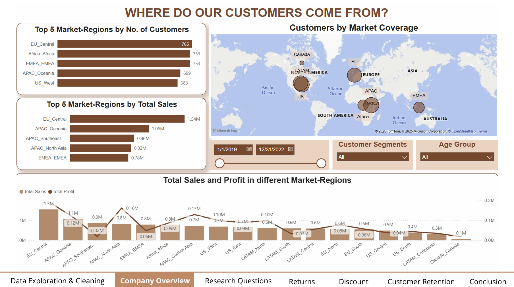

## Research Questions

### Data Analysis Context

#### Problem statement

Global Superstore has been increasing returns, observed sales-profit inconsistency between Mondays and Sundays and also high number of customers showing a sign of leaving (34%) over the past 4 years.

#### Research questions

1. Which factors affect customers' decisions to return orders?
2. Why is there a profit-sales inconsistency between Mondays and Sundays?
3. What causes customers to disengage and stop buying?

## Returns Analysis

### Why did our customers return orders?

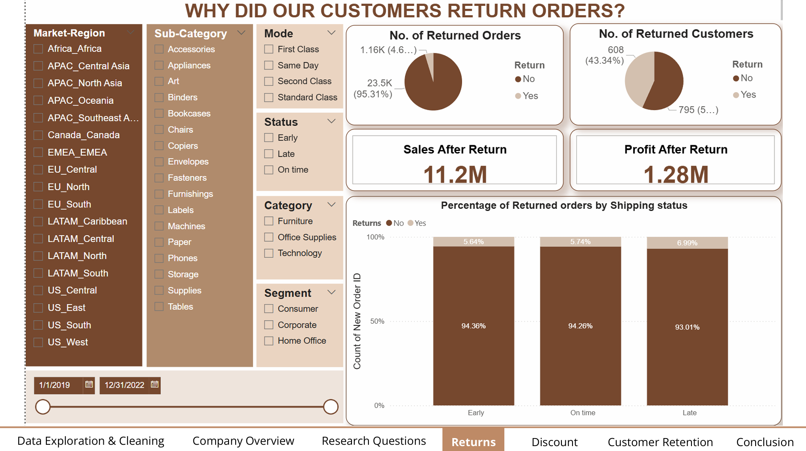

### What factors impact return rates?

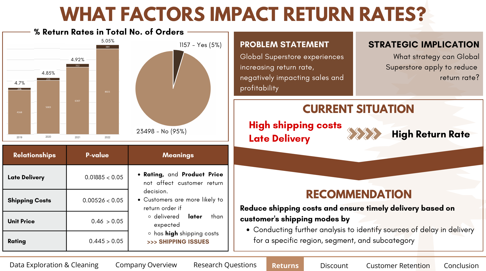

### When do our customers make orders?

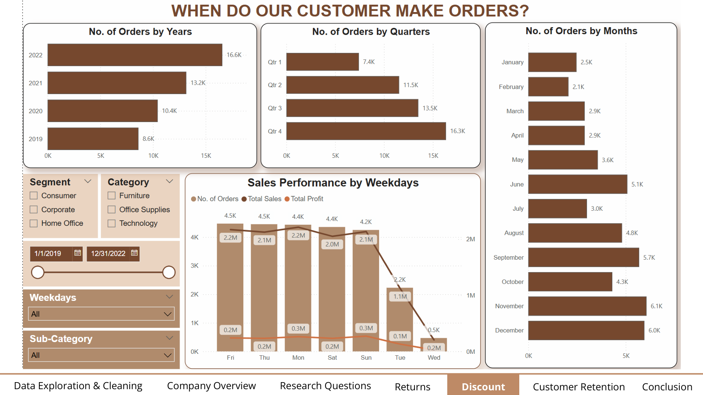

## Discount Analysis

### Sales vs Profit on Weekdays

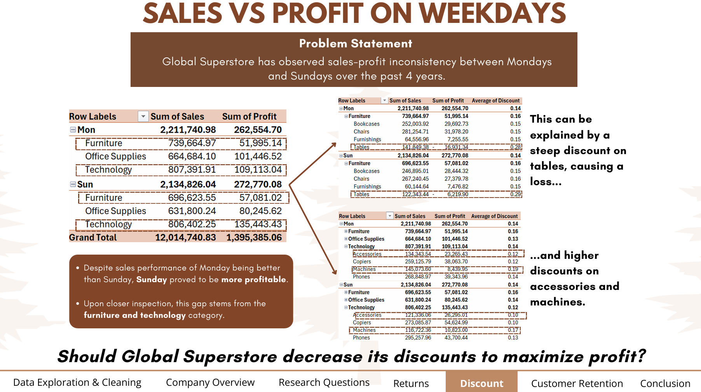

### Do discounts affect the quantity sold?

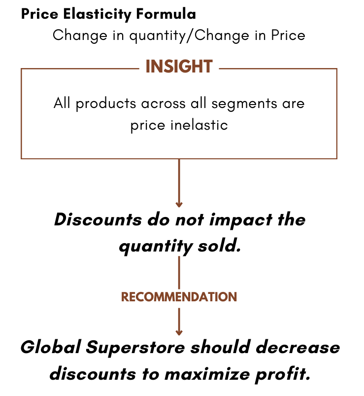

## Customer Retention

### Who are our loyal customers?

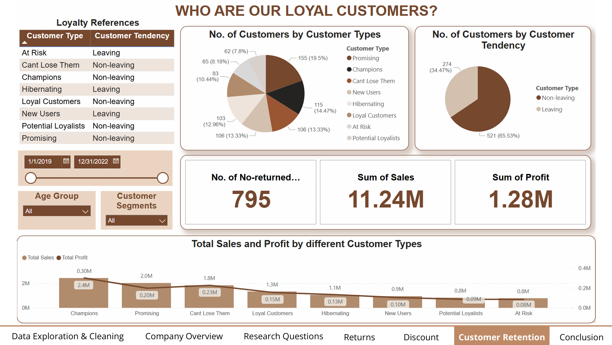

### What causes customers to disengage and stop buying?

#### Problem Statement

Global Super Store has been experiencing many customers showing signs of leaving (34%) over the past 4 years.

| Current situation                                         | Recommendation                                                                |
| --------------------------------------------------------- | ----------------------------------------------------------------------------- |
| **Leaving group:** High shipping cost, High discount rate | Reduce shipping costs and discount rate to drive customers' purchase behavior |

## Conclusion

| Research questions                                                     | Research answers                                                                                                                                       |
| ---------------------------------------------------------------------- | ------------------------------------------------------------------------------------------------------------------------------------------------------ |
| Which factors affect customers' decisions to return orders?            | Late delivery and high shipping costs affect customers' return decisions → Reduce shipping costs and ensure timely delivery on customer shipping mode. |
| Why is there a profit-sales inconsistency between Mondays and Sundays? | With all products across all segments being price inelastic, discounts are the main cause for this inconsistency.                                      |
| What causes customers to disengage and stop buying?                    | High shipping cost affect the customers' purchase behaviors while discount rate have no impact → Decrease the discount rate and shipping cost.         |

## Appendix

### Return Rate

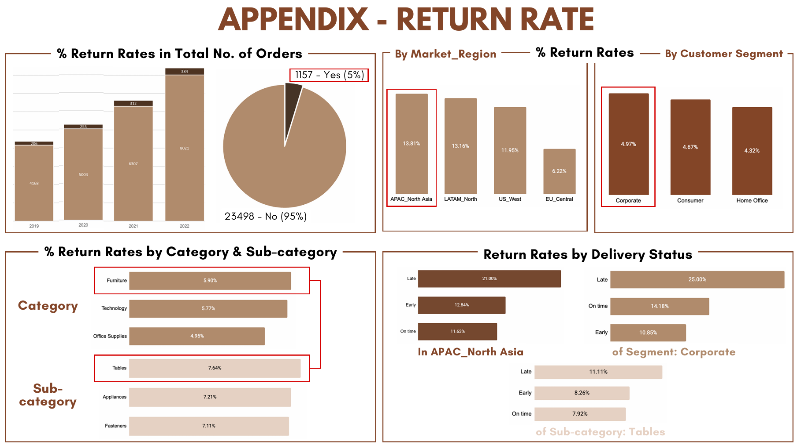

### Customer Retention

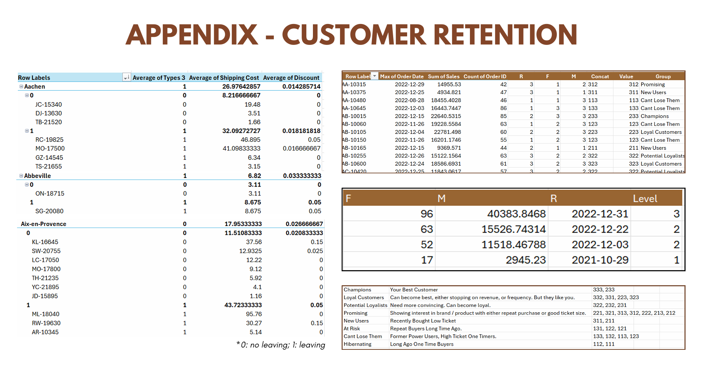
